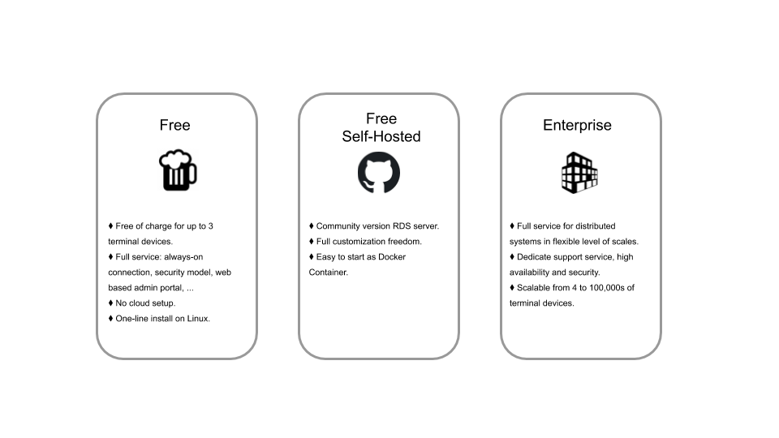

# RDS

**RDS** stands for Remote Diagnosis Service, is a development tool helping developers to gain diagnostic terminal access to headless embedded systems, espeically suitable for IOT or distributed systems.

## Why?

RDS greatly simplify the complexity and shorten the time required to setup distributed systems for development and production environments.

Depending on Linux distributions selected, one would need to configure networking profiles, arrange some relay service to make all terminals stay in touch with the cloud; not to mention the need for constant remote patch and system maintenances.  

RDS is battle proven for these scenarios.  It helps you to focus right on your service logic and terminal system development without worrying the lower level issues like NAT traversal, terminal device registration and latest network security best practices, just to name a few.

## Pricing

RDS full feature service is **FREE** for you play around up to THREE "always on" terminal connections with T2T's [playaround site](https://rds.tic-tac-toe.io/).

If you need more than that, there are 2 alternatives to consider.  

Firstly, you can opt for self-hosted sever in your cloud environment.  In this case, the protocol stays the same but you need to consider about further scale issues especially SaaS always on connection maintenance and cost considerations.

Alternatively, T2T also provides full service at great rates for customers requiring different tiers of terminal numbers:

- Up to 100 terminals
- Up to 1000 terminals
- Up to 10K terminals
- Beyond

Feel free to contact [rds@t2t.io](mailto:rds@t2t.io) for details.
